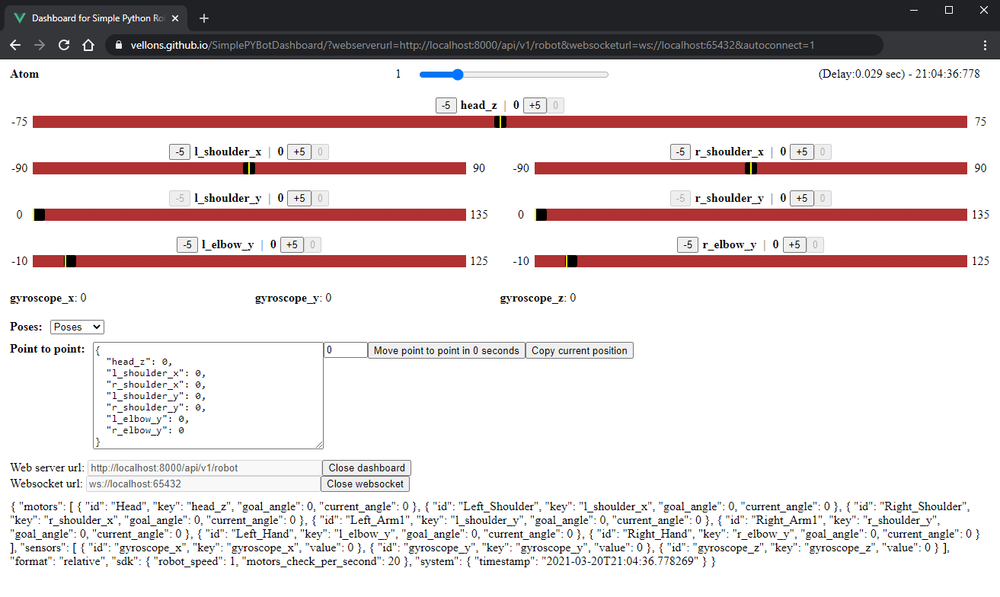

# Dashboard for Simple Python Robot SDK
Basic development dashboard for [SimplePYBotSDK](https://firebase.google.com/docs/auth).

Dev link: https://vellons.github.io/SimplePYBotDashboard/


## Project setup
```
npm install
```

### Compiles and hot-reloads for development
```
npm run serve
```

### Compiles and minifies for production
```
npm run build
```

### Lints and fixes files
```
npm run lint
```

### Customize configuration
See [Configuration Reference](https://cli.vuejs.org/config/).
